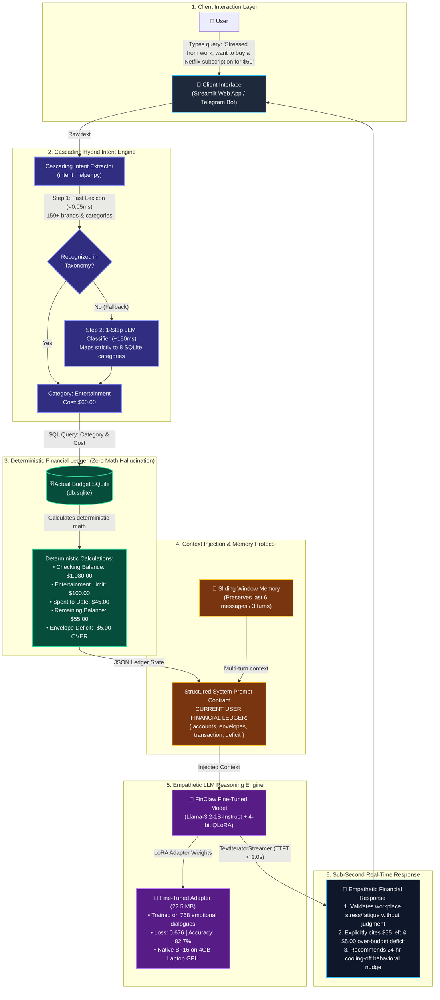

# 🏛️ FinClaw End-to-End System Architecture

This document contains the complete system architecture diagram for **FinClaw** (Emotionally Intelligent LLM Agent for Context-Aware Financial Decision Support). 

You can view the rendered diagram directly on GitHub, copy the Mermaid code into [Mermaid Live Editor](https://mermaid.live) to export a high-resolution PNG/SVG for your PowerPoint slides, or paste it directly into Gamma / Notion.

---

## 📊 End-to-End Workflow Diagram (Mermaid)

---

## 🧩 Architectural Component Breakdown (For Speaking Notes)

When presenting this architecture slide to mentors, explain the **6 distinct layers**:

1. **Client Interaction Layer (UI):**
   * Accepts natural, emotional user language across Streamlit or Telegram.
   * Users don't need to enter financial tables manually; they talk like they would to a friend.

2. **Cascading Hybrid Intent Engine:**
   * **Fast Path (< 0.05 ms):** Uses an in-memory dictionary of 150+ brands (Netflix, Starbucks, Nike, Utilities) and robust regex patterns (`worth 60`, `costs 50`) to extract entities instantly with **zero latency**.
   * **LLM Classifier Fallback (~150 ms):** If an unmapped or unusual purchase is detected (e.g. *"ceramic pottery wheel"*), the local model classifies it strictly into one of the 8 SQLite envelope categories (`Entertainment`, `Food`, `Personal Care`, `Bills`, `Bills (Flexible)`, `Rent/housing`, `Savings`, `General`).

3. **Deterministic Financial Ledger (Actual Budget SQLite `db.sqlite`):**
   * **Why it matters:** Neural networks are probabilistic and unreliable at mental arithmetic. 
   * **Separation of Concerns:** 100% of arithmetic calculations (subtractions, envelope ceilings, deficits) are executed deterministically by SQL queries, ensuring **0% math hallucinations**.

4. **Context Injection & Sliding Memory Protocol:**
   * Formats the ground-truth ledger into the strict `CURRENT USER FINANCIAL LEDGER` JSON contract required by the fine-tuned model.
   * Integrates a sliding conversation window (retaining the last 6 messages / 3 turns) so the AI remembers prior turns without context overflow.

5. **Empathetic LLM Reasoning Engine (FinClaw):**
   * Built on Meta's `Llama-3.2-1B-Instruct` fine-tuned with **4-bit QLoRA** and native **BF16**.
   * Consumes only **1.07 GB VRAM**, enabling smooth execution on consumer laptop GPUs (NVIDIA RTX 3050 4GB).
   * Fine-tuned on 758 multi-turn dialogues to combine psychological validation with strict budget discipline.

6. **Sub-Second Streaming Response:**
   * Uses Hugging Face's `TextIteratorStreamer` to deliver **Time-To-First-Token in ~0.85 seconds**.
   * Delivers a three-part response: (1) Emotional validation $\rightarrow$ (2) Arithmetic ground truth $\rightarrow$ (3) Cooling-off / alternative behavioral nudge.
