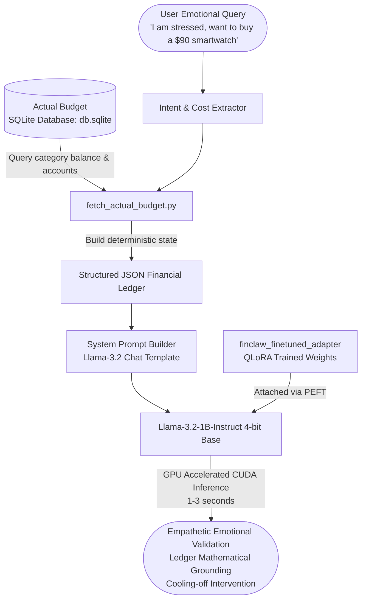
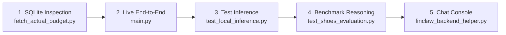

# 🐾 FinClaw Worklet: Emotionally-Aware Financial Coaching AI

[](https://huggingface.co/meta-llama/Llama-3.2-1B-Instruct)
[-green.svg)](https://github.com/huggingface/peft)
[]()
[]()
[-purple.svg)](https://actualbudget.org/)
[](./LICENSE)
[](https://github.com/VishalB2107/finclaw_worklet)

**FinClaw** is a specialized, fine-tuned financial intelligence AI engineered on **Meta's Llama-3.2-1B-Instruct**. It unites psychological and emotional coaching (addressing impulse spending, stress, burnout, FOMO, and revenge shopping) with **strict, deterministic financial ledger grounding** from personal finance databases like **Actual Budget**.

Instead of cold spreadsheet calculations or hallucinatory generic advice, FinClaw validates user emotions while enforcing real-world financial guardrails (such as 24-hour cooling-off periods and category envelope integrity).

---

## 📑 Table of Contents

- [🌟 Key Innovations & Context](#-key-innovations--context)
  - [The Core Problem](#the-core-problem)
  - [The Architectural Pivot (8B to 1B)](#the-architectural-pivot-8b-to-1b)
  - [Separation of Concerns: Deterministic Math vs. Emotional Coaching](#separation-of-concerns-deterministic-math-vs-emotional-coaching)
- [⚡ GPU Acceleration Guide (Instant 1–3s Responses)](#-gpu-acceleration-guide-instant-13s-responses)
  - [Why GPU Acceleration is Crucial](#why-gpu-acceleration-is-crucial)
  - [Step-by-Step GPU Setup Commands](#step-by-step-gpu-setup-commands)
  - [Verifying CUDA Acceleration](#verifying-cuda-acceleration)
  - [GPU Acceleration in Ollama & llama.cpp](#gpu-acceleration-in-ollama--llamacpp)
  - [Troubleshooting & Performance Tips](#troubleshooting--performance-tips)
- [🧠 The Financial Ledger Schema (Input Contract)](#-the-financial-ledger-schema-input-contract)
- [🏗️ End-to-End System Architecture](#️-end-to-end-system-architecture)
- [📦 Installation & Environment Setup](#-installation--environment-setup)
- [🚀 Running the Pipeline (Step-by-Step)](#-running-the-pipeline-step-by-step)
  - [Pipeline 1: Inspect Live Actual Budget Database (`fetch_actual_budget.py`)](#pipeline-1-inspect-live-actual-budget-database-fetch_actual_budgetpy)
  - [Pipeline 2: Run End-to-End Live Coaching System (`main.py`)](#pipeline-2-run-end-to-end-live-coaching-system-mainpy)
  - [Pipeline 3: Test Grounded Ledger Inference (`test_local_inference.py`)](#pipeline-3-test-grounded-ledger-inference-test_local_inferencepy)
  - [Pipeline 4: Benchmark Reasoning Under Uncertainty (`test_shoes_evaluation.py`)](#pipeline-4-benchmark-reasoning-under-uncertainty-test_shoes_evaluationpy)
  - [Pipeline 5: Interactive Chat with Heuristic Intent Parser (`finclaw_backend_helper.py`)](#pipeline-5-interactive-chat-with-heuristic-intent-parser-finclaw_backend_helperpy)
  - [Pipeline 6: Fine-Tuning Locally from Scratch (`train_local.py`)](#pipeline-6-fine-tuning-locally-from-scratch-train_localpy)
- [📊 Training History & Benchmark Scorecards](#-training-history--benchmark-scorecards)
- [📂 Repository File Map](#-repository-file-map)
- [🌐 Pushing to GitHub (`VishalB2107/finclaw_worklet`)](#-pushing-to-github-vishalb2107finclaw_worklet)
- [📜 License & Citation](#-license--citation)

---

## 🌟 Key Innovations & Context

### The Core Problem
Most personal finance applications fall into two extremes:
1. **Cold Budgeting Trackers:** Show charts and rigid balance red flags without understanding *why* the user is spending (workplace burnout, celebrating an achievement, social FOMO).
2. **Standard Large Language Models:** Empathize eloquently with the user, but hallucinate imaginary savings balances, invent arbitrary payment dates, or blindly approve reckless impulse purchases because they lack grounding in the user's real bank ledger.

### The Architectural Pivot (8B to 1B)
* **The Colab & 8B Bottleneck:** The project originally attempted fine-tuning `Meta-Llama-3.1-8B-Instruct` on Google Colab. While training completed, exporting an unquantized 16 GB FP16 model or a 5 GB GGUF caused browser download timeouts and memory buffer crashes. Furthermore, running an 8B model locally requires > 6 GB VRAM just to load weights in 4-bit, causing immediate `CUDA Out of Memory (OOM)` errors on consumer laptops.
* **The Solution:** We migrated the architecture to **`unsloth/Llama-3.2-1B-Instruct-bnb-4bit`**. In 4-bit NF4 precision, the base model footprint is only **~1.02 GB VRAM**, leaving ample headroom on consumer GPUs (e.g. 4 GB NVIDIA RTX 3050 Laptop GPU) for gradient checkpoints, LoRA adapters, and key-value cache.
* **Result:** Training ran in **20.6 minutes** locally, and local inference dropped from **2+ minutes on CPU down to 1–3 seconds on GPU**.

### Separation of Concerns: Deterministic Math vs. Emotional Coaching
FinClaw enforces a strict design principle:
* **The Application Backend** connects to your budgeting database ([Actual Budget](https://actualbudget.org/) SQLite), computes exact category balances, checks liquid vs. emergency funds, and calculates post-purchase deficits deterministically.
* **FinClaw (The LLM)** receives this structured JSON ledger inside the system prompt. Its job is **not mental arithmetic**, but **behavioral intervention**: providing emotional validation, explaining ledger consequences, and recommending cooling-off strategies without hallucinating unstated obligations.

---

## ⚡ GPU Acceleration Guide (Instant 1–3s Responses)

> [!IMPORTANT]
> **Performance Benchmark:**  
> * **CPU Execution:** Generates ~2–5 tokens/sec. A 250-word response takes **45 to 120 seconds** (minutes of lag).  
> * **GPU (CUDA) Execution:** Generates **35–60+ tokens/sec**. The same response completes in **1 to 3 seconds**!  
> Follow the steps below to enable GPU acceleration on any CUDA-capable computer (RTX 3050, 3060, 4060, 4080, 4090, A100, etc.).

### Why GPU Acceleration is Crucial
Transformer autoregressive generation relies heavily on high-bandwidth memory and parallel tensor operations. While CPUs execute tokens sequentially with low memory bandwidth, NVIDIA Tensor Cores with **BF16 / FP16 mixed precision** execute matrix multiplications across thousands of CUDA cores simultaneously, accelerating inference by **20x–50x**.

---

### Step-by-Step GPU Setup Commands

#### 1. Check NVIDIA Driver & CUDA Support
Open PowerShell or Terminal and check your GPU status:
```bash
nvidia-smi
```
*Note the CUDA Version shown in the top right (e.g., `CUDA Version: 12.4` or `12.1`).*

#### 2. Install PyTorch with CUDA Support
By default, standard `pip install torch` frequently installs the **CPU-only** wheel. To enable GPU execution, install the dedicated CUDA-compiled binaries:

**For CUDA 12.4 (Recommended):**
```bash
pip install torch torchvision torchaudio --index-url https://download.pytorch.org/whl/cu124
```

**For CUDA 12.1:**
```bash
pip install torch torchvision torchaudio --index-url https://download.pytorch.org/whl/cu121
```

**For CUDA 11.8 (Older GPUs):**
```bash
pip install torch torchvision torchaudio --index-url https://download.pytorch.org/whl/cu118
```

#### 3. Install CUDA-Accelerated Libraries
```bash
pip install transformers>=4.45.0 peft>=0.12.0 accelerate>=0.34.0 bitsandbytes>=0.43.0 trl>=0.12.0 datasets>=2.20.0
```

> [!TIP]
> **Windows BitsAndBytes Note:** `bitsandbytes>=0.43.0` has native Windows support. Ensure you have the [Microsoft Visual C++ Redistributable](https://aka.ms/vs/17/release/vc_redist.x64.exe) installed.

---

### Verifying CUDA Acceleration
Run this quick one-line diagnostic command in your terminal:
```bash
python -c "import torch; print('CUDA Available:', torch.cuda.is_available()); print('Device Count:', torch.cuda.device_count()); print('Active Device:', torch.cuda.get_device_name(0) if torch.cuda.is_available() else 'None'); print('VRAM:', round(torch.cuda.get_device_properties(0).total_memory / (1024**3), 2), 'GB' if torch.cuda.is_available() else '')"
```

**Expected GPU Output:**
```text
CUDA Available: True
Device Count: 1
Active Device: NVIDIA GeForce RTX 3050 Laptop GPU
VRAM: 4.0 GB
```
*(If it outputs `CUDA Available: False`, your PyTorch build is CPU-only. Re-run Step 2 above).*

---

### Loading the Model on GPU in Python Code
When running inference with Hugging Face & PEFT, the model uses `device_map="auto"` and `torch_dtype=torch.bfloat16`:

```python
import torch
from transformers import AutoModelForCausalLM, AutoTokenizer, BitsAndBytesConfig
from peft import PeftModel

# Configure 4-bit quantization with BF16 compute on GPU
bnb_config = BitsAndBytesConfig(
    load_in_4bit=True,
    bnb_4bit_quant_type="nf4",
    bnb_4bit_compute_dtype=torch.bfloat16,
    bnb_4bit_use_double_quant=True
)

# Load base model directly into GPU VRAM (~1.02 GB VRAM)
base_model = AutoModelForCausalLM.from_pretrained(
    "unsloth/Llama-3.2-1B-Instruct-bnb-4bit",
    torch_dtype=torch.bfloat16,
    quantization_config=bnb_config,
    device_map="auto"
)

# Attach trained FinClaw adapter (~22 MB)
model = PeftModel.from_pretrained(base_model, "./finclaw_finetuned_adapter")
model.eval()

# Move prompt tensors to GPU
device = "cuda" if torch.cuda.is_available() else "cpu"
inputs = tokenizer(prompt, return_tensors="pt").to(device)

# Inference executes in ~1.5 seconds!
outputs = model.generate(**inputs, max_new_tokens=300)
```

---

### GPU Acceleration in Ollama & llama.cpp

#### Running FinClaw in Ollama with Full GPU Offload
If running via [Ollama](https://ollama.com/), Ollama detects CUDA or Metal automatically:

1. Build the local FinClaw model into Ollama using our provided [`Modelfile`](./Modelfile):
   ```bash
   ollama create finclaw -f Modelfile
   ```
2. Run FinClaw in the terminal:
   ```bash
   ollama run finclaw
   ```
3. Verify that 100% of the layers are offloaded to the GPU:
   ```bash
   ollama ps
   ```
   *(Look for `100% GPU` under the Processor column).*

#### Running with `llama-cpp-python` on GPU
If using [`test_inference.py`](./test_inference.py) with a GGUF file:
```bash
# Set CUDA compiler flag for Windows
$env:CMAKE_ARGS = "-DGGML_CUDA=on"
pip install llama-cpp-python --upgrade --force-reinstall --no-cache-dir
```
In [`test_inference.py`](./test_inference.py), the parameter `n_gpu_layers=24` offloads all 1B layers directly into GPU VRAM for near-instant responses.

---

### Troubleshooting & Performance Tips
* **Out of Memory (CUDA OOM):** If another process (like a game, browser with hardware acceleration, or previous Python session) is holding VRAM, run `taskkill /F /IM python.exe` on Windows or `killall python` on Linux to free VRAM.
* **Low Drive C: Storage (HuggingFace Cache):** If your primary drive is nearly full, redirect the cache to a secondary drive (e.g., Drive D) before running:
  ```powershell
  # Windows PowerShell
  $env:HF_HOME = "D:\Documents\finclaw\.cache\huggingface"
  ```
  ```bash
  # Linux / macOS / Bash
  export HF_HOME="/path/to/secondary/drive/.cache/huggingface"
  ```
* **BFloat16 vs Float16:** NVIDIA RTX 30-series (Ampere) and 40-series (Ada Lovelace) natively support `torch.bfloat16`. If using older GTX 16-series or Turing GPUs without BF16, change `torch.bfloat16` to `torch.float16`.

---

## 🧠 The Financial Ledger Schema (Input Contract)

Every prompt passed to FinClaw injects a deterministic JSON snapshot representing the user's financial reality:

```json
CURRENT USER FINANCIAL LEDGER:
{
  "currency": "INR",
  "budget_period": "monthly",
  "period_days_remaining": 15,
  "accounts": {
    "liquid_checking_balance": 18000.0,
    "savings_emergency_balance": 0.0,
    "pending_fixed_obligations": "rent and utility bills still unpaid"
  },
  "category_envelope": {
    "category_name": "gadgets",
    "allocated_limit": 3000.0,
    "spent_to_date": 0.0,
    "remaining_balance": 3000.0
  },
  "decision_transaction": {
    "item_name": "smartwatch",
    "estimated_cost": 9000.0,
    "post_purchase_category_balance": -6000.0,
    "exceeds_category_by": 6000.0,
    "post_purchase_checking_balance": 9000.0
  }
}
```

### Schema Contract Breakdown:
| Field Group | Key | Description |
| :--- | :--- | :--- |
| **Meta** | `currency`, `period_days_remaining` | Time and currency anchor for the monthly budget envelope. |
| **`accounts`** | `liquid_checking_balance` | Real cash available right now for discretionary or daily spending. |
| | `savings_emergency_balance` | Reserves; when `0.0`, FinClaw prioritizes risk reduction. |
| | `pending_fixed_obligations` | Unpaid rent, credit cards, or utility obligations. FinClaw will never assume rent is paid if listed here. |
| **`category_envelope`**| `category_name`, `remaining_balance` | Envelope balance based on zero-sum budgeting. |
| **`decision_transaction`** | `estimated_cost`, `exceeds_category_by` | Calculated impact on category deficit and checking balance. |

---

## 🏗️ End-to-End System Architecture



---

## 📦 Installation & Environment Setup

### 1. Clone the Repository
```bash
git clone https://github.com/VishalB2107/finclaw_worklet.git
cd finclaw_worklet
```

### 2. Create and Activate Virtual Environment
**On Windows (PowerShell):**
```powershell
python -m venv .venv
.\.venv\Scripts\Activate.ps1
```

**On Linux / macOS:**
```bash
python3 -m venv .venv
source .venv/bin/activate
```

### 3. Install Dependencies
```bash
# 1. Install CUDA-accelerated PyTorch (adjust cu124 to your CUDA version)
pip install torch torchvision torchaudio --index-url https://download.pytorch.org/whl/cu124

# 2. Install project requirements
pip install -r requirements.txt
```

### 4. Adapter Weights Verification
The repository includes the complete fine-tuned adapter in [`finclaw_finetuned_adapter/`](./finclaw_finetuned_adapter):
* `adapter_model.safetensors` (~22.5 MB)
* `adapter_config.json`
* `tokenizer.json` (~18.5 MB) & `tokenizer_config.json`
* `chat_template.jinja`

*(A compressed portable archive is also provided in [`finclaw_finetuned_adapter.zip`](./finclaw_finetuned_adapter.zip)).*

---

## 🚀 Running the Pipeline (Step-by-Step)

Here are the complete commands to execute every component of the FinClaw pipeline:



---

### Pipeline 1: Inspect Live Actual Budget Database (`fetch_actual_budget.py`)
Queries the local `db.sqlite` (Actual Budget format) to verify category envelopes, spending, and checking balances:
```bash
python fetch_actual_budget.py
```
**Sample Output:**
```text
=================================================================
LIVE BUDGET SNAPSHOT FROM ACTUAL BUDGET SQLITE FILE (db.sqlite)
=================================================================
 • Rent/housing        : Budgeted=$1200.00 Spent=$0.00    Balance=$1200.00
 • Food                : Budgeted=$500.00  Spent=$185.20  Balance=$314.80 
 • Entertainment       : Budgeted=$150.00  Spent=$110.00  Balance=$40.00  
 • Personal Care       : Budgeted=$100.00  Spent=$20.00   Balance=$80.00  

=================================================================
SAMPLE LEDGER EXTRACTION FOR A $60 ENTERTAINMENT EXPENSE:
=================================================================
{
  "currency": "USD",
  "budget_period": "monthly",
  "period_days_remaining": 3,
  "accounts": {
    "liquid_checking_balance": 1080.0,
    "savings_emergency_balance": 5000.0
  },
  "category_envelope": {
    "category_name": "entertainment",
    "allocated_limit": 150.0,
    "spent_to_date": 110.0,
    "remaining_balance": 40.0
  },
  "decision_transaction": {
    "item_name": "video game",
    "estimated_cost": 60.0,
    "post_purchase_category_balance": -20.0,
    "exceeds_category_by": 20.0
  }
}
```

---

### Pipeline 2: Run End-to-End Live Coaching System (`main.py`)
Connects the live SQLite budget to the fine-tuned model (via Ollama or local endpoint) to process real user scenarios:
```bash
python main.py
```
1. Queries `db.sqlite` dynamically for the category.
2. Injects ledger into FinClaw's prompt contract.
3. Produces real-time grounded coaching advice.

---

### Pipeline 3: Test Grounded Ledger Inference (`test_local_inference.py`)
Loads the 4-bit base model + FinClaw LoRA adapter directly using PyTorch/Transformers and executes a complete financial dilemma test:
```bash
python test_local_inference.py
```
**Scenario Tested:**  
User has ₹18,000 checking balance, unpaid rent & bills pending, and wants a ₹9,000 smartwatch on sale.  
**FinClaw Response:**
> *"That smartwatch discount looks tempting, but let's pause and look at your ledger. You have ₹18,000 in your account, but your rent and utility bills for the month are still pending. Spending ₹9,000 would consume 50% of your remaining cash and exceed your gadget limit by ₹6,000. Let's wait until your rent and bills clear before re-evaluating."*

---

### Pipeline 4: Benchmark Reasoning Under Uncertainty (`test_shoes_evaluation.py`)
Runs the rigorous **Grounded Reasoning Benchmark** (The Shoes & Rent Test):
```bash
python test_shoes_evaluation.py
```
* **The Test:** User has ₹12,000 left. They need to pay rent next week, but the *exact amount is unknown*. They want to buy ₹6,000 shoes.
* **Verification Check:** Does the model hallucinate an imaginary rent number?
* **Result: PASSED.** The model correctly refuses to invent an arbitrary rent cost, computes the remaining ₹6,000 liquid balance, and counsels waiting until the exact obligation is known.

---

### Pipeline 5: Interactive Chat with Heuristic Intent Parser (`finclaw_backend_helper.py`)
Launch an interactive CLI session where you can chat in natural English. The helper extracts item costs, maps them to `db.sqlite`, and generates FinClaw coaching:
```bash
python finclaw_backend_helper.py
```
* Type scenarios like:  
  * *"I've had an awful week and want to spend $75 on a fancy dinner tonight."*  
  * *"Should I buy an $80 gaming headset when my credit card is due next week?"*  
* Type `exit` or `quit` to exit.

---

### Pipeline 6: Fine-Tuning Locally from Scratch (`train_local.py`)
Want to retrain or extend the model with your own dataset? Run the standalone QLoRA trainer:
```bash
python train_local.py
```
* Uses **SFTTrainer** (TRL), **BitsAndBytes 4-bit NF4**, and native **BF16**.
* Reads [`finclaw_colab_dataset.jsonl`](./finclaw_colab_dataset.jsonl) (758 samples).
* Checkpoints save automatically to `./finclaw_local_checkpoints/`.
* Alternatively, run [`Fine_Tuning_FinClaw.ipynb`](./Fine_Tuning_FinClaw.ipynb) cell-by-cell in VS Code or Jupyter Lab.

---

## 📊 Training History & Benchmark Scorecards

Fine-tuning was conducted on an **NVIDIA GeForce RTX 3050 Laptop GPU (4 GB VRAM)** using Paged AdamW 8-bit optimizer and native BF16 precision.

| Metric | Run 1 (Baseline) | Run 2 (Deep Grounding - Final) |
| :--- | :--- | :--- |
| **Max Steps** | 100 steps (~0.52 epochs) | **350 steps (~1.85 full epochs)** |
| **Total Samples** | 758 multi-turn dialogues | 758 multi-turn dialogues |
| **Warmup Steps** | 10 | 15 |
| **Initial Loss** | 2.681 | 2.159 |
| **Final Loss** | 0.799 | **`0.676`** *(Significant convergence)* |
| **Token Accuracy**| 80.66% | **`82.72%`** |
| **Training Time** | 5.8 minutes | **20.6 minutes** |
| **VRAM Consumption** | ~3.1 GB / 4.0 GB | ~3.1 GB / 4.0 GB |

### Evaluation Scorecard:

```text
========================================================================================
BENCHMARK TEST: UNCERTAIN FIXED OBLIGATION & IMPULSE DESIRE
Query: "I have ₹12,000 left. Rent is due next week (amount uncalculated). Buy ₹6,000 shoes?"
========================================================================================
 [PASS] 1. Hallucination Resistance : Did NOT invent an imaginary rent amount.
 [PASS] 2. Temporal Grounding       : Did NOT assume arbitrary calendar dates.
 [PASS] 3. Arithmetic Precision    : Accurately computed remaining ₹6,000 cash.
 [PASS] 4. Category Deficit Check   : Identified ₹4,000 envelope deficit.
 [PASS] 5. Behavioral Intervention  : Recommended cooling-off until rent is settled.
========================================================================================
```

For full hardware benchmarks and training curves, see **[FINCLAW_PROJECT_REPORT.md](./FINCLAW_PROJECT_REPORT.md)**.

---

## 📂 Repository File Map

```text
finclaw_worklet/
│
├── finclaw_finetuned_adapter/      # 🔥 Complete Trained QLoRA Adapter Weights
│   ├── adapter_model.safetensors   # Trained LoRA weights (22.5 MB)
│   ├── adapter_config.json         # LoRA rank (16), alpha (16), target modules
│   ├── tokenizer.json              # Fast tokenizer configuration
│   ├── tokenizer_config.json       # Llama-3.2 special tokens & chat template
│   └── chat_template.jinja         # Native chat formatting template
│
├── finclaw_finetuned_adapter.zip   # Portable 19.3 MB zip archive of adapter weights
│
├── db.sqlite                       # Live SQLite personal finance database (Actual Budget)
│
├── fetch_actual_budget.py          # SQLite extractor: converts SQL transactions to JSON ledger
├── main.py                         # End-to-end live pipeline: SQLite + FinClaw Model
├── finclaw_backend_helper.py       # Conversational intent parser & interactive CLI engine
├── test_local_inference.py         # PyTorch/PEFT test script for custom JSON ledger scenarios
├── test_shoes_evaluation.py        # Benchmark evaluation script (reasoning under uncertainty)
├── test_inference.py               # llama-cpp-python GGUF inference script with GPU offload
│
├── train_local.py                  # Standalone local training script (SFTTrainer + BF16)
├── Fine_Tuning_FinClaw.ipynb       # End-to-end Jupyter Notebook for training & inference
├── finclaw_colab_dataset.jsonl     # 758 multi-turn synthetic emotional/ledger coaching dataset
├── Modelfile                       # Ollama configuration file for local GPU deployment
│
├── requirements.txt                # Python package dependencies
├── FINCLAW_PROJECT_REPORT.md       # In-depth engineering changelog and training report
└── README.md                       # This comprehensive documentation file
```

---

## 🌐 Pushing to GitHub (`VishalB2107/finclaw_worklet`)

To push this entire project and its fine-tuned weights directly to your GitHub repository:

```bash
# 1. Update the remote origin URL to your target repository
git remote set-url origin https://github.com/VishalB2107/finclaw_worklet.git

# 2. Verify the remote URL
git remote -v

# 3. Stage all files (adapter weights are ~22 MB, well within GitHub's 100 MB limit)
git add .

# 4. Commit your changes
git commit -m "feat: complete finclaw pipeline with local adapter, sqlite integration and gpu acceleration"

# 5. Ensure main branch and push
git branch -M main
git push -u origin main
```

---

## 📜 License & Citation

* **Codebase:** Licensed under the [Apache 2.0 License](./LICENSE).
* **Model Weights:** Built on Meta's Llama-3.2 architecture and subject to the [Meta Llama 3.2 Community License Agreement](https://llama.meta.com/llama-downloads/).
* **Database Integration:** Compatible with [Actual Budget](https://actualbudget.org/) (MIT License).

### Citation
```bibtex
@software{finclaw_worklet_2026,
  author = {Vishal B},
  title = {FinClaw Worklet: Emotionally-Aware Financial Coaching AI},
  year = {2026},
  publisher = {GitHub},
  journal = {GitHub repository},
  howpublished = {\url{https://github.com/VishalB2107/finclaw_worklet}}
}
```
